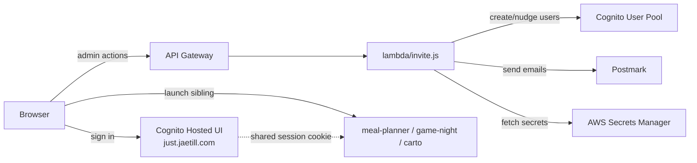

# Architecture

Portal is a Vite + Tailwind SPA with a single Lambda backend for admin operations against the shared Cognito user pool.

## Components

```mermaid
graph LR
  Browser[Browser] -->|sign in| HostedUI[Cognito Hosted UI<br/>just.jaetill.com]
  Browser -->|admin actions| APIGW[API Gateway]
  APIGW --> InviteLambda[lambda/invite.js]
  InviteLambda -->|create/nudge users| Cognito[Cognito User Pool]
  InviteLambda -->|send emails| Postmark
  InviteLambda -->|fetch secrets| SM[AWS Secrets Manager]
  Browser -->|launch sibling| Sibling[meal-planner / game-night / carto]
  HostedUI -.shared session cookie.-> Sibling
```

## Auth flow

1. User visits `jaetill.com` (CloudFront -> S3 origin serving `index.html`).
2. Frontend redirects to Cognito Hosted UI at `just.jaetill.com` (PKCE OAuth).
3. After successful sign-in, Cognito redirects to `jaetill.com/callback.html`, which exchanges the code for tokens and sets a session cookie at `just.jaetill.com`.
4. Sibling apps (meal-planner at `meals.jaetill.com`, game-night at `game.jaetill.com`, etc.) use their own Cognito App Clients tied to the same user pool. Their callback handlers see the shared cookie and skip the prompt.

## Admin flow

Admins (members of the `admins` Cognito group) interact with `lambda/invite.js` via the portal UI:

- `POST /invite` with `body.action = 'create'` -> creates a new user via `AdminCreateUser` with an explicit temp password, suppresses Cognito's own invitation email, and sends a Postmark invite from `jason@jaetill.com` with the credentials, a link to the portal, and the names of the apps granted.
- `POST /invite` with `body.action = 'nudge'` -> for a user in `FORCE_CHANGE_PASSWORD` status, generates a fresh temp password and re-sends the same email in its 'reminder' wording. 60-second in-memory cooldown per user.
- `POST /invite` with `body.action = 'nudge-all-stuck'` -> iterates all users in `FORCE_CHANGE_PASSWORD` and nudges each (respecting the cooldown).
- `POST /invite` with `body.action = 'delete'` -> `AdminDeleteUser`, any status. Refuses self-deletion.

Both email variants render from `lambda/lib/emails.js`, which is pure and unit
tested. They share the credentials block and the sign-in link deliberately:
those drifting apart is what stranded invitees for four months.

**Cognito's own invitation email is never used.** Its default template states a
username and password but contains no link, so recipients had nowhere to go and
sat in `FORCE_CHANGE_PASSWORD`. `MessageAction: 'SUPPRESS'` on `AdminCreateUser`
turns it off; deliverability is better from the Postmark sender anyway.

The sign-in link must point at the portal (`https://jaetill.com/`), never the
Cognito custom domain — see the note in `lambda/lib/emails.js`.

All admin actions go through the same Lambda authorizer that checks for the `admins` group membership.

## What lives where

- `src/` - frontend (Vite + Tailwind + vanilla JS)
- `lambda/invite.js` - admin operations (single Lambda, single API Gateway route)
- `index.html`, `callback.html` - OAuth entry + callback pages
- `dist/` - Vite build output (gitignored)

## What lives elsewhere

- Cognito user pool, App Clients, Hosted UI config - shared with sibling apps; managed manually today
- API Gateway, Lambda function, IAM role - managed manually today (Phase 6 of platform adoption will source-control these)
- Postmark API key, Cognito client secrets - AWS Secrets Manager at `portal/postmark` and `portal/cognito`
